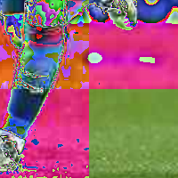

```python
import PIL
print('Pillow Version:', PIL.__version__)
from PIL import Image
import numpy as np
```

    Pillow Version: 8.1.0


```python
image = Image.open('images/foot1.png')
print(image.size)
print(image.mode)
display(image)
```

    (1309, 834)
    RGBA


    

    


```python
data = np.asarray(image)
print(type(data))
print(data.shape)
print(data.dtype)
```

    <class 'numpy.ndarray'>
    (834, 1309, 4)
    uint8


```python
new_image = np.copy(np.float32(data[500:700, 500:700, :]))

new_image[:,:int(new_image.shape[1]/2),:3] *= 2
new_image[:int(new_image.shape[0]/2),:,:3] *= 2

image2 = Image.fromarray(np.uint8(new_image))
print(image2.size)
print(image2.mode)
display(image2)
```

    (200, 200)
    RGBA


    

    


```python
def contrast_between(a_point, b_point):
    # somme des abs diffs de chacune des dimensions
    return sum([abs(int(a) - int(b)) for (a,b) in zip(a_point, b_point)])

def contrast_around(image, x , y):
    point = image[x, y]
    contrasts = []
    if y > 0: # au dessus
        contrasts.append(contrast_between(point, image[x, y - 1]))
        if x > 0:
            # à gauche
            contrasts.append(contrast_between(point, image[x - 1, y - 1]))
        if x < image.shape[0] - 1:
            # à droite
            contrasts.append(contrast_between(point, image[x + 1, y - 1]))

    if y < image.shape[1] - 1: # en dessous
        contrasts.append(contrast_between(point, image[x, y + 1]))
        if x > 0:
            # à gauche
            contrasts.append(contrast_between(point, image[x - 1, y + 1]))
        if x < image.shape[0] - 1:
            # à droite
            contrasts.append(contrast_between(point, image[x + 1, y + 1]))
    if x > 0:
        # à gauche
        contrasts.append(contrast_between(point, image[x - 1, y]))
    if x < image.shape[0] - 1:
        # à droite
        contrasts.append(contrast_between(point, image[x + 1, y]))
    return sum(contrasts) # the sum of contrast is arbitrary ( test max, mean etc ... )
```


```python
crop_test = data[:, :, :]

constrast_image = np.zeros((crop_test.shape[0], crop_test.shape[1]))
print(constrast_image.shape)
for x in range(crop_test.shape[0]):
    for y in range(crop_test.shape[1]):
        constrast_image[x, y] = contrast_around(crop_test, x, y)
print(constrast_image)
```

    (834, 1309)
    [[24. 33. 20. ... 29. 29. 10.]
     [33. 51. 34. ... 48. 45. 21.]
     [37. 53. 35. ... 54. 51. 23.]
     ...
     [ 6.  9. 18. ... 30. 27.  6.]
     [ 6.  9. 12. ... 30. 21.  6.]
     [ 0.  0.  6. ... 18. 12.  0.]]


```python
constrast_image *= 255 / constrast_image.max()
print(constrast_image.max())
print(constrast_image.shape)
display(Image.fromarray(np.uint8(constrast_image)))
```

    255.0
    (834, 1309)


    

    


```python
kernel = Image.open('images/kernel1.png').convert('LA')

kernel_data = np.copy(np.float32(np.asarray(kernel)[:,:,0]))
kernel_data *= 255 / kernel_data.max()

print(type(kernel_data))
print(kernel_data.shape)
print(kernel_data.dtype)
print(kernel_data.max())
print(kernel_data)
display(Image.fromarray(np.uint8(kernel_data)))
```

    <class 'numpy.ndarray'>
    (139, 148)
    float32
    255.0
    [[ 3.8931298  1.9465649  3.8931298 ... 21.412214  19.465649  17.519085 ]
     [ 3.8931298  3.8931298  3.8931298 ... 15.572519  15.572519  13.625955 ]
     [ 7.7862597  5.839695   5.839695  ...  5.839695   5.839695   5.839695 ]
     ...
     [ 0.         0.         0.        ...  7.7862597  7.7862597  5.839695 ]
     [ 0.         0.         0.        ...  5.839695   5.839695   3.8931298]
     [ 1.9465649  1.9465649  1.9465649 ...  3.8931298  3.8931298  1.9465649]]


    

    


```python
def crop_greyscale_image_with_padding(image_data, x, y, width, height):
    destination = np.zeros((height, width))
    for dest_x in range(width):
        image_x = dest_x + x
        if image_x >= 0 and image_x < image_data.shape[1]:
            for dest_y in range(height):
                image_y = dest_y + y
                if image_y >= 0 and image_y < image_data.shape[0]:
                    destination[dest_y, dest_x] = image_data[image_y,image_x]    
    return destination

def apply_kernel(kernel_data, image_data, x, y, display_slice = False):
    sliced = crop_greyscale_image_with_padding(constrast_image, x - int(kernel_data.shape[1]/2), y- int(kernel_data.shape[0]/2), kernel_data.shape[1], kernel_data.shape[0])
    diff = kernel_data - sliced
    kerneled = diff * diff
    if display_slice:
        display(Image.fromarray(np.uint8(sliced)))
        display(Image.fromarray(np.uint8(kerneled)))
    return kerneled.sum()

def test_kernel(x, y):
    applied = apply_kernel(kernel_data, constrast_image, x, y, display_slice = True)
    print("mean score", applied)
    

test_kernel(0,0)
test_kernel(550, 450)
test_kernel(1150, 700)
test_kernel(1150, 750)
```


    

    


    

    


    mean score 33665874.35706804


    

    


    

    


    mean score 37453237.833645836


    

    


    

    


    mean score 26926991.715219397


    

    


    

    


    mean score 17080057.080900673


```python
test_scale = 5
kerneled_image = np.zeros((int(constrast_image.shape[0] / test_scale), int(constrast_image.shape[1] / test_scale)))
print(kerneled_image.shape)
step = 5
step_modulo = int(kerneled_image.shape[0] * kerneled_image.shape[1] * step / 100)
progress = 0
for y in range(0, kerneled_image.shape[0]):
    for x in range(0, kerneled_image.shape[1]):
        kerneled_image[y, x] = apply_kernel(kernel_data, constrast_image, x *  test_scale, y *  test_scale)
        progress += 1
        if progress % step_modulo == 0:
            print(int(progress / (kerneled_image.shape[0] * kerneled_image.shape[1])  * 100) , "% done")
kerneled_image *= 255 / kerneled_image.max()
display(Image.fromarray(np.uint8(kerneled_image)))
```

    (166, 261)
    4 % done
    9 % done
    14 % done
    19 % done
    24 % done
    29 % done
    34 % done
    39 % done
    44 % done
    49 % done
    54 % done
    59 % done
    64 % done
    69 % done
    74 % done
    79 % done
    84 % done
    89 % done
    94 % done
    99 % done


    

    


```python
detection_threshold = 210

reverted_kerneled_image =  - kerneled_image
reverted_kerneled_image =  reverted_kerneled_image + abs(reverted_kerneled_image.min())
reverted_kerneled_image *= 255 / reverted_kerneled_image.max()
display(Image.fromarray(np.uint8(reverted_kerneled_image)))
display(Image.fromarray(np.uint8((reverted_kerneled_image > detection_threshold) * 255)))
```


    

    


    

    

